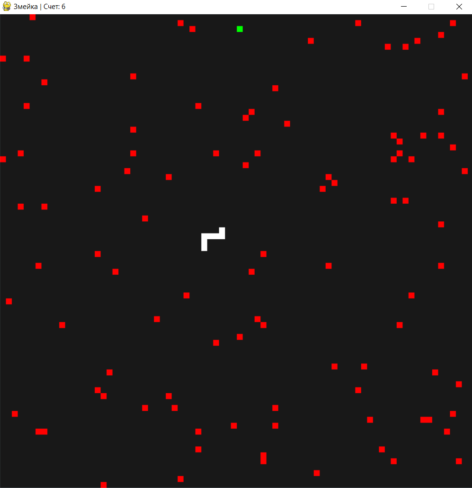

# Змейка Pygame 


Змейка Pygame - это классическая игра "Змейка", реализованная с использованием библиотеки Pygame. Она предоставляет простой и увлекательный игровой процесс, где игроки управляют змейкой, чтобы съесть еду и стать длиннее, избегая препятствий и столкновений с собственным телом змейки.

## Особенности

- Звуковые эффекты при поедании еды и событиях завершения игры
- Реализованы препятствия для увеличения сложности
- полноэкранный режим (demo)
- возможность поставить на паузу

## Подготовка к запуску

1. Клонируйте репозиторий:

   ```bash
   git clone https://github.com/Alex-One152/Snake_pygame
   ```

2. Перейдите в директорию проекта:

   ```bash
   cd Snake_pygame
   ```

3. Установите необходимые зависимости:

   ```bash
   pip install -r requirements.txt
   ```

## Запуск

Запустите игру, выполните файл `main.py`:

```bash
python main.py
```
### Или можно просто скачать готовый билд под windows
[](https://github.com/Alex-One152/Snake_pygame/raw/main/dist/Snake.exe)

Управление:
- Используйте клавиши со стрелками для навигации змейкой: Вверх, Вниз, Влево, Вправо.
- Нажмите Esc, чтобы поставить игру на паузу.
- Нажмите F, чтобы переключиться в фуллскрин.


## Скриншоты



## Вклад

Буду очень рад если кто-то поможет с фиксом багов и рефакторингом! Если у вас есть предложения или улучшения, пожалуйста, откройте проблему (issue) или отправьте запрос на включение изменений (pull request).

## Лицензия

Этот проект лицензирован в соответствии с [Лицензией MIT](LICENSE).
